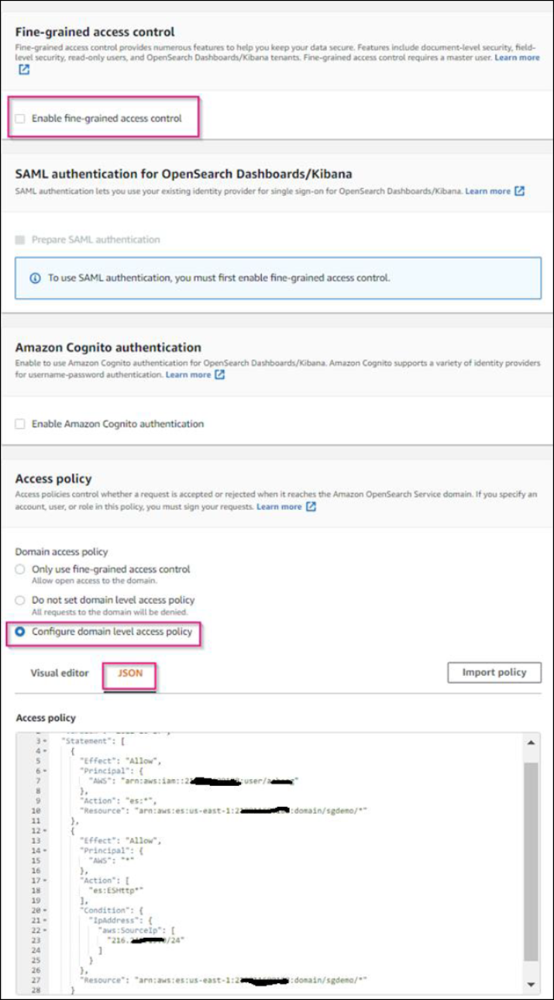
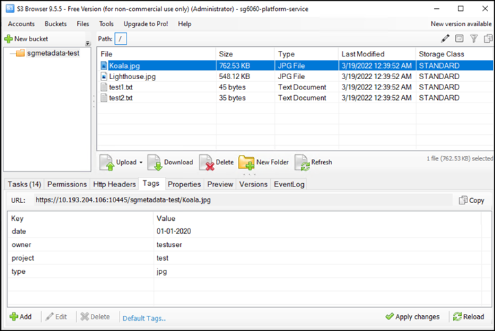

= StorageGRID 検索統合サービスを設定する
:allow-uri-read: 

Angela Cheng_

[role="lead"]
このガイドでは、Amazon StorageGRID 11.6検索統合サービスとオンプレミスのElasticsearchを使用するようにNetAppを設定する手順について詳しく説明します。

== はじめに

StorageGRID は、3種類のプラットフォームサービスをサポートしています。

* * StorageGRID CloudMirrorレプリケーション*。StorageGRID バケットから指定された外部のデスティネーションに特定のオブジェクトをミラーリングします。
* *通知*。バケット単位のイベント通知：オブジェクトに対して実行された特定の処理に関する通知を、指定された外部のAmazon Simple Notification Service（Amazon SNS）に送信します。
* *検索統合サービス*。外部サービスを使用してメタデータを検索または分析できるように、指定されたElasticsearchインデックスにSimple Storage Service（S3）オブジェクトメタデータを送信します。

プラットフォームサービスは、テナントマネージャのUIを使用してS3テナントによって設定されます。詳細については、を参照してください https://["プラットフォームサービスの使用に関する考慮事項"^]。

このドキュメントは、の補足資料として機能します https://["StorageGRID 11.6テナントガイド"^] およびに、検索統合サービス用のエンドポイントとバケットの設定手順と例を示します。ここで紹介するAmazon Web Services（AWS）またはオンプレミスのElasticsearchセットアップの手順は、基本的なテストやデモ目的にのみ使用します。

対象読者は、Grid Manager、テナントマネージャに精通している必要があり、S3ブラウザにアクセスして、StorageGRID 検索統合テストの基本的なアップロード（PUT）処理とダウンロード（GET）処理を実行できます。

== テナントを作成し、プラットフォームサービスを有効にします

. Grid Managerを使用してS3テナントを作成し、表示名を入力してS3プロトコルを選択する。
. [アクセス許可]ページで、[プラットフォームサービスを許可する]オプションを選択します。必要に応じて、他の権限を選択します。
+
image::../media/storagegrid-search-integration-service/sg-sis-select-permissions.png[権限のスクリーンショットを選択します]

. テナントのrootユーザの初期パスワードを設定するか、グリッドでフェデレーションが有効になっている場合は、テナントアカウントを設定するためのrootアクセス権限を持つフェデレーテッドグループを選択します。
. [ルートとしてサインイン]をクリックし、[バケット：バケットの作成と管理]を選択します。
+
Tenant Managerのページが表示されます。

. Tenant Managerで、My Access Keysを選択してS3アクセスキーを作成およびダウンロードし、あとでテストを実施します。

== Amazon OpenSearchとの検索統合サービス

=== Amazon OpenSearch（旧Elasticsearch）サービスのセットアップ

この手順 は、テスト/デモ目的でのみOpenSearchサービスをすばやく簡単にセットアップするために使用します。検索統合サービスにオンプレミスのElasticsearchを使用している場合は、を参照してください xref:search-integration-services-with-on-premises-elasticsearch[検索統合サービスをオンプレミスのElasticsearchと利用できます]。

NOTE: OpenSearchサービスに登録するには、有効なAWSコンソールログイン、アクセスキー、シークレットアクセスキー、および権限が必要です。

. の手順に従って、新しいドメインを作成します link:https://docs.aws.amazon.com/opensearch-service/latest/developerguide/gsgcreate-domain.html["AWS OpenSearchサービス開始前の準備"^]次の場合を除きます。
+
** 手順 4ドメイン名：sgdemo
** 手順10：きめ細かなアクセスコントロール：「きめ細かなアクセスコントロールを有効にする」オプションの選択を解除します。
** 手順12.アクセスポリシー：Configure Level Access Policyを選択し、JSONタブを選択して次の例を使用してアクセスポリシーを変更します。
+
*** 強調表示されたテキストを、AWS Identity and Access Management（IAM）IDとユーザ名に置き換えます。
*** 強調表示されているテキスト（IPアドレス）を、AWSコンソールへのアクセスに使用したローカルコンピュータのパブリックIPアドレスに置き換えます。
*** ブラウザタブを開き、に移動します https://["https://checkip.amazonaws.com"^] をクリックして、パブリックIPを検索してください。
+
[source, json]
----
{

    "Version": "2012-10-17",
    "Statement": [
        {
        "Effect": "Allow",
        "Principal":
        {"AWS": "arn:aws:iam:: nnnnnn:user/xyzabc"},
        "Action": "es:*",
        "Resource": "arn:aws:es:us-east-1:nnnnnn:domain/sgdemo/*"
        },
        {
        "Effect": "Allow",
        "Principal": {"AWS": "*"},
        "Action": [
        "es:ESHttp*"
                ],
        "Condition": {
            "IpAddress": {
                "aws:SourceIp": [ "nnn.nnn.nn.n/nn"
                    ]
                }
        },
        "Resource": "arn:aws:es:us-east-1:nnnnnn:domain/sgdemo/*"
        }
    ]
}
----
+

. ドメインがアクティブになるまで15～20分待ちます。
+
image::../media/storagegrid-search-integration-service/sg-sis-activating-domain.png[ドメインスクリーンショットをアクティブ化してい]

. OpenSearch Dashboards URLをクリックして、新しいタブでドメインを開き、ダッシュボードにアクセスします。access deniedエラーが表示された場合は、アクセスポリシーのソースIPアドレスがコンピュータのパブリックIPに正しく設定されていて、ドメインダッシュボードへのアクセスが許可されていることを確認します。
. ダッシュボードの開始ページで、自分で探索（Explore on your own）を選択します。メニューから、[管理]->[開発ツール]を選択します
. Dev Tools -> Consoleで、StorageGRID オブジェクトメタデータの保存にインデックスを使用する「Put <index>」と入力します。次の例では、インデックス名「メタデータ」を使用します。小さい三角形の記号をクリックして、PUTコマンドを実行します。次のスクリーンショットの例に示すように、正しい結果が右側のパネルに表示されます。
+
image::../media/storagegrid-search-integration-service/sg-sis-using-put-command-for-index.png[インデックスのスクリーンショットにPUTコマンドを使用する]

. インデックスがAmazon OpenSearch UIのsgdomain > Indicesの下に表示されていることを確認します。
+
image::../media/storagegrid-search-integration-service/sg-sis-verifying-the-index.png[Verifying - The indexスクリーンショット]

== プラットフォームサービスエンドポイントの設定

プラットフォームサービスエンドポイントを設定するには、次の手順を実行します。

. Tenant Managerで、ストレージ（S3）>プラットフォームサービスのエンドポイントに移動します。
. [エンドポイントの作成]をクリックし、次のように入力して、[続行]をクリックします。
+
** 表示名の例は「AWS- OpenSearch」です
** 手順 フィールドの前の「URI」の手順2の下のスクリーンショットのドメインエンドポイント。
** URNフィールドで前の手順 の手順2で使用したドメインARNの末尾に'/<index>/_docを追加します
+
この例では、URNはarn：aws：es：us-east -1：211234567890：domain/sgdemo/sgmedata/_docになります。

+
image::../media/storagegrid-search-integration-service/sg-sis-enter-end-points-details.png[エンドポイント-詳細なスクリーンショット]

. Amazon OpenSearchのsgdomainにアクセスするには、認証タイプとしてAccess Keyを選択し、Amazon S3のアクセスキーとシークレットキーを入力します。次のページに移動するには、[続行]をクリックします。
+
image::../media/storagegrid-search-integration-service/sg-sis-authenticate-connections-to-endpoints.png[「エンドポイントへの接続の認証」のスクリーンショット]

. エンドポイントを確認するには、Use Operating System CA Certificate and Test and Create Endpointを選択します。検証に成功すると、次の図のようなエンドポイント画面が表示されます。検証に失敗した場合は、URNのパスの末尾に「/<index>/_doc」が含まれていて、AWSアクセスキーとシークレットキーが正しいことを確認してください。
+
image::../media/storagegrid-search-integration-service/sg-sis-platform-service-endpoints.png[プラットフォームサービスエンドポイントのスクリーンショット]

== 検索統合サービスをオンプレミスのElasticsearchと利用できます

=== オンプレミスのElasticsearchセットアップ

この手順 は、テスト目的でのみDockerを使用するElasticsearchとKibanaオンプレミスを迅速にセットアップするためのものです。ElasticsearchサーバとKibanaサーバがすでに存在する場合は、ステップ5に進みます。

. これを実行します link:https://docs.docker.com/engine/install/["Dockerインストール手順 の略"^] Dockerをインストールするため。を使用します link:https://docs.docker.com/engine/install/centos/["CentOS Dockerは手順 をインストールする"^] このセットアップでは、
+
--
....
sudo yum install -y yum-utils
sudo yum-config-manager --add-repo https://download.docker.com/linux/centos/docker-ce.repo
sudo yum install docker-ce docker-ce-cli containerd.io
sudo systemctl start docker
....
--
+
** リブート後にDockerを起動するには、次のように入力します。
+
--
 sudo systemctl enable docker
--
** 「vm.max_map_count」値を262144に設定します。
+
--
 sysctl -w vm.max_map_count=262144
--
** リブート後も設定を維持するには、次のように入力します。
+
--
 echo 'vm.max_map_count=262144' >> /etc/sysctl.conf
--

. に従ってください link:https://www.elastic.co/guide/en/elasticsearch/reference/current/getting-started.html["Elasticsearchクイックスタートガイド"^] ElasticsearchとKibana Dockerを自己管理のためのセクションでインストールして実行できます。この例では、バージョン8.1をインストールしました。
+

TIP: Elasticsearchが作成したユーザ名/パスワードとトークンをメモしておきます。これらのトークンは、Kibana UIおよびStorageGRID プラットフォームエンドポイント認証を開始するために必要です。

+
image::../media/storagegrid-search-integration-service/sg-sis-search-integration-elasticsearch.png[検索統合検索検索検索検索のelasticscreenscreenscreen]

. Kibana Dockerコンテナが起動すると、コンソールにURLリンク「\ https://0.0.0.0:5601`」が表示されます。0.0.0.0を、URL内のサーバIPアドレスと置き換えます。
. ユーザ名「elastic」と、前述の手順でElasticによって生成されたパスワードを使用して、Kibana UIにログインします。
. 初めてログインする場合は、ダッシュボードのようこそページで、自分でエクスプローラ（Explore on your own）を選択します。メニューから、Management > Dev Toolsを選択します。
. Dev Tools Console画面で、StorageGRID オブジェクトメタデータの保存にこのインデックスを使用する「Put <index>」と入力します。この例では'インデックス名sgmetadataを使用します小さい三角形の記号をクリックして、PUTコマンドを実行します。次のスクリーンショットの例に示すように、正しい結果が右側のパネルに表示されます。
+
image::../media/storagegrid-search-integration-service/sg-sis-execute-put-command.png[PUTコマンドの実行のスクリーンショット]

== プラットフォームサービスエンドポイントの設定

プラットフォームサービスのエンドポイントを設定するには、次の手順を実行します。

. Tenant Managerで、ストレージ（S3）>プラットフォームサービスのエンドポイントに移動します
. [エンドポイントの作成]をクリックし、次のように入力して、[続行]をクリックします。
+
** 表示名の例: elastic`
** URI:`\https://<elasticsearch-server-ipまたはhostname>:9200`
** urn:`urn:<何か>:es:::<se-unique text>/<index-name>/_doc`ここで、index-nameはKibanaコンソールで使用した名前です。例:`urn:local:es::sgmd/sgmetadata/_doc`
+
image::../media/storagegrid-search-integration-service/sg-sis-platform-service-endpoint-details.png[プラットフォームサービスエンドポイントの詳細のスクリーンショット]

. 認証タイプとしてBasic HTTPを選択し、Elasticsearchのインストールプロセスによって生成されたユーザ名「elastic」とパスワードを入力します。次のページに移動するには、[続行]をクリックします。
+
image::../media/storagegrid-search-integration-service/sg-sis-platform-service-endpoint-authentication-type.png[プラットフォームサービスエンドポイントの認証のスクリーンショット]

. エンドポイントを確認するには、Do not verify Certificate and Test and Create Endpointを選択します。検証に成功すると、次のスクリーンショットと同様のエンドポイント画面が表示されます。検証が失敗した場合は、URN、URI、およびユーザ名とパスワードのエントリが正しいことを確認してください。
+
image::../media/storagegrid-search-integration-service/sg-sis-successfully-verified-endpoint.png[エンドポイントが検証されました]

== バケット検索統合サービスの設定

プラットフォームサービスエンドポイントの作成後、次の手順では、オブジェクトの作成、削除、またはそのメタデータ/タグの更新が行われるたびに定義済みのエンドポイントにオブジェクトメタデータを送信するように、このサービスをバケットレベルで設定します。

Tenant Managerを使用して検索統合を設定し、カスタムのStorageGRID 設定XMLをバケットに次のように適用できます。

. Tenant Managerで、Storage（S3）> Bucketsに移動します
. Create Bucket（バケットの作成）をクリックし、バケット名（例：sgmetadatatest'）を入力して、デフォルトのus-east-1リージョンを受け入れます。
. [Continue]>[Create Bucket]をクリックします。
. バケットの概要ページを表示するには、バケット名をクリックし、プラットフォームサービスを選択します。
. [検索統合を有効にする]ダイアログボックスを選択します。表示されたXMLボックスに、この構文を使用して設定XMLを入力します。
+
強調表示されたURNは、定義したプラットフォームサービスエンドポイントと一致する必要があります。別のブラウザタブを開いてTenant Managerにアクセスし、定義済みのプラットフォームサービスエンドポイントからURNをコピーできます。

+
この例ではプレフィックスを使用していません。つまり、このバケット内のすべてのオブジェクトのメタデータが、前に定義したElasticsearchエンドポイントに送信されます。

+
[listing]
----
<MetadataNotificationConfiguration>
    <Rule>
        <ID>Rule-1</ID>
        <Status>Enabled</Status>
        <Prefix></Prefix>
        <Destination>
            <Urn> urn:local:es:::sgmd/sgmetadata/_doc</Urn>
        </Destination>
    </Rule>
</MetadataNotificationConfiguration>
----
. S3 Browserを使用して、テナントアクセス/シークレットキーを使用してStorageGRID に接続し、テストオブジェクトを「sgmetadata-test」バケットにアップロードし、タグまたはカスタムメタデータをオブジェクトに追加します。
+

. Kibana UIを使用して、オブジェクトメタデータがsgmetadataのインデックスにロードされたことを確認します。
+
.. メニューから、Management > Dev Toolsを選択します。
.. 左側のコンソールパネルにサンプルクエリを貼り付け、三角形の記号をクリックして実行します。
+
次の例のスクリーンショットでは、クエリ1のサンプル結果に4つのレコードが表示されています。これはバケット内のオブジェクトの数に一致します。

+
[listing]
----
GET sgmetadata/_search
{
    "query": {
        "match_all": { }
}
}
----
+

+
次のスクリーンショットのクエリ2のサンプル結果は、タグタイプがjpgの2つのレコードを示しています。

+
[listing]
----
GET sgmetadata/_search
{
    "query": {
        "match": {
            "tags.type": {
                "query" : "jpg" }
                }
            }
}
----
+
image::../media/storagegrid-search-integration-service/sg-sis-query-two-sample.png[クエリ2のサンプル]

== 追加情報の参照先

このドキュメントに記載されている情報の詳細については、以下のドキュメントや Web サイトを参照してください。

* https://["プラットフォームサービスとは"^]
* https://["StorageGRID 11.6 ドキュメント"^]

