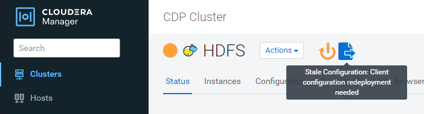

= StorageGRID でCloudera Hadoop S3Aコネクタを使用します
:allow-uri-read: 

[role="lead"]
Hadoopは、データサイエンティストに今しばらくの間愛用されてきました。Hadoopでは、シンプルなプログラミングフレームワークを使用して、複数のコンピュータクラスタにまたがる大規模なデータセットを分散処理できます。Hadoopは、ローカルのコンピューティングとストレージを所有するマシンごとに、単一のサーバから数千のマシンにスケールアップするように設計されています。

== S3AをHadoopワークフローに使用する理由

データ量の増加に伴い、新しいマシンにコンピューティングとストレージを個別に追加するアプローチは非効率的になっています。リソースを効率的に使用し、インフラを管理するという課題は、リニアに拡張する必要があります。

このような課題に対処するために、Hadoop S3AクライアントはS3オブジェクトストレージに対する高性能なI/Oを提供します。S3Aを使用してHadoopワークフローを実装することで、オブジェクトストレージをデータリポジトリとして活用でき、コンピューティングとストレージを分離することができます。これにより、コンピューティングとストレージを別々に拡張できます。コンピューティングリソースとストレージを分離することで、コンピューティングジョブに適切な量のリソースを割り当て、データセットのサイズに基づいて容量を提供することもできます。そのため、Hadoopワークフローの総所有コストを削減することができます。

== StorageGRID を使用するようにS3Aコネクタを構成します

=== 前提条件

* StorageGRID S3エンドポイントのURL、テナントS3アクセスキー、およびHadoop S3A接続テスト用のシークレットキー。
* クラスタ内の各ホストに対するClouderaクラスタとrootまたはsudo権限を付与して、Javaパッケージをインストールします。

2022年4月時点で、StorageGRID 11.0.14とCloudera 7.1.7のJava 11.0.14が、11.5および11.6に対してテストされました。ただし、Javaのバージョン番号は新規インストール時と異なる場合があります。

=== Javaパッケージをインストールします

. を確認します https://docs.cloudera.com/cdp-private-cloud-upgrade/latest/release-guide/topics/cdpdc-java-requirements.html["Clouderaサポートマトリックス"^] を参照してください。
. をダウンロードします https://www.oracle.com/java/technologies/downloads/["Java 11.xパッケージ"^] Clouderaクラスタオペレーティングシステムと同じです。このパッケージをクラスタ内の各ホストにコピーします。この例では、CentOSにrpmパッケージを使用しています。
. 各ホストにrootとしてログインするか、sudo権限を持つアカウントを使ってログインします。各ホストで次の手順を実行します。
+
.. パッケージをインストールします。
+
[listing]
----
$ sudo rpm -Uvh jdk-11.0.14_linux-x64_bin.rpm
----
.. Javaがインストールされている場所を確認します。複数のバージョンがインストールされている場合は、新しくインストールしたバージョンをデフォルトに設定します。
+
[listing, subs="specialcharacters,quotes"]
----
alternatives --config java

There are 2 programs which provide 'java'.

  Selection    Command
-----------------------------------------------
 +1           /usr/java/jre1.8.0_291-amd64/bin/java
  2           /usr/java/jdk-11.0.14/bin/java

Enter to keep the current selection[+], or type selection number: 2
----
.. この行を/etc/profile'の末尾に追加しますパスは、上記の選択のパスと一致する必要があります。
+
[listing]
----
export JAVA_HOME=/usr/java/jdk-11.0.14
----
.. 次のコマンドを実行して、プロファイルを有効にします。
+
[listing]
----
source /etc/profile
----

=== Cloudera HDFS S3A構成

* 手順 *

. Cloudera Manager GUIで、クラスタ（Clusters）> HDFSを選択し、構成（Configuration）を選択します。
. カテゴリでAdvancedを選択し、下にスクロールして「core-site .xml」用のクラスタ全体のAdvanced Configuration Snippet（Safety Valve）を探します。
. （+）記号をクリックし、次の値ペアを追加します。
+
[cols="1a,4a"]
|===
| 名前 | 価値 

 a| 
fs.s3a.access.key
 a| 
_<tenant StorageGRID のs3アクセスキー__

 a| 
fs.s3a.secret.key
 a| 
_<tenant s3 secret key from StorageGRID >_

 a| 
FS.s3a.connection.ssl.enabled
 a| 
[true or false]（このエントリがない場合のデフォルトはhttps）

 a| 
FS.s3a.endpoint
 a| 
_ StorageGRID S3エンドポイント：port>_

 a| 
FS.s3a.impl
 a| 
org.apache.hadoop .fs.s3a.S3AFileSystem

 a| 
FS.s3a.path.style.access
 a| 
[true or false]（このエントリがない場合のデフォルトの仮想ホスト形式）

|===
+
*サンプルスクリーンショット*

+
image::../media/hadoop-s3a/hadoop-s3a-configuration.png[S3A構成]

. [Save Changes]ボタンをクリックします。HDFSメニューバーからStale Configurationアイコンを選択し、次のページでRestart Stale Servicesを選択して、Restart Nowを選択します。
+

== StorageGRID へのS3A接続をテストします

=== 基本的な接続テストを実行します

Clouderaクラスタのいずれかのホストにログインし、「hadoop fs s-ls s3a：//_<bucket-name>_/`」と入力します。

次の例では、パスsyleと既存のHDFSテストバケットおよびテストオブジェクトを使用します。

[listing]
----
[root@ce-n1 ~]# hadoop fs -ls s3a://hdfs-test/
22/02/15 18:24:37 WARN impl.MetricsConfig: Cannot locate configuration: tried hadoop-metrics2-s3a-file-system.properties,hadoop-metrics2.properties
22/02/15 18:24:37 INFO impl.MetricsSystemImpl: Scheduled Metric snapshot period at 10 second(s).
22/02/15 18:24:37 INFO impl.MetricsSystemImpl: s3a-file-system metrics system started
22/02/15 18:24:37 INFO Configuration.deprecation: No unit for fs.s3a.connection.request.timeout(0) assuming SECONDS
Found 1 items
-rw-rw-rw-   1 root root       1679 2022-02-14 16:03 s3a://hdfs-test/test
22/02/15 18:24:38 INFO impl.MetricsSystemImpl: Stopping s3a-file-system metrics system...
22/02/15 18:24:38 INFO impl.MetricsSystemImpl: s3a-file-system metrics system stopped.
22/02/15 18:24:38 INFO impl.MetricsSystemImpl: s3a-file-system metrics system shutdown complete.
----

=== トラブルシューティング

==== シナリオ 1

StorageGRID へのHTTPS接続を使用し、15分後に「handshake_failure」エラーを取得します。

*理由：StorageGRID への接続に古いTLS暗号スイートまたはサポートされていないTLS暗号スイートを使用しているJRE／JDKの旧バージョン。

*エラーメッセージの例*

[listing]
----
[root@ce-n1 ~]# hadoop fs -ls s3a://hdfs-test/
22/02/15 18:52:34 WARN impl.MetricsConfig: Cannot locate configuration: tried hadoop-metrics2-s3a-file-system.properties,hadoop-metrics2.properties
22/02/15 18:52:34 INFO impl.MetricsSystemImpl: Scheduled Metric snapshot period at 10 second(s).
22/02/15 18:52:34 INFO impl.MetricsSystemImpl: s3a-file-system metrics system started
22/02/15 18:52:35 INFO Configuration.deprecation: No unit for fs.s3a.connection.request.timeout(0) assuming SECONDS
22/02/15 19:04:51 INFO impl.MetricsSystemImpl: Stopping s3a-file-system metrics system...
22/02/15 19:04:51 INFO impl.MetricsSystemImpl: s3a-file-system metrics system stopped.
22/02/15 19:04:51 INFO impl.MetricsSystemImpl: s3a-file-system metrics system shutdown complete.
22/02/15 19:04:51 WARN fs.FileSystem: Failed to initialize fileystem s3a://hdfs-test/: org.apache.hadoop.fs.s3a.AWSClientIOException: doesBucketExistV2 on hdfs: com.amazonaws.SdkClientException: Unable to execute HTTP request: Received fatal alert: handshake_failure: Unable to execute HTTP request: Received fatal alert: handshake_failure
ls: doesBucketExistV2 on hdfs: com.amazonaws.SdkClientException: Unable to execute HTTP request: Received fatal alert: handshake_failure: Unable to execute HTTP request: Received fatal alert: handshake_failure
----
*解決策: JDK 11.x以降がインストールされていることを確認し'デフォルトのJavaライブラリに設定しますを参照してください <<Javaパッケージをインストールします>> 詳細については、を参照してください。

==== シナリオ2：

StorageGRID に接続できませんでした。エラーメッセージ「要求されたターゲットへの有効な証明書パスが見つかりませんでした」が表示されます。

*理由：* StorageGRID S3エンドポイントサーバ証明書がJavaプログラムで信頼されていません。

エラーメッセージの例：

[listing]
----
[root@hdp6 ~]# hadoop fs -ls s3a://hdfs-test/
22/03/11 20:58:12 WARN impl.MetricsConfig: Cannot locate configuration: tried hadoop-metrics2-s3a-file-system.properties,hadoop-metrics2.properties
22/03/11 20:58:13 INFO impl.MetricsSystemImpl: Scheduled Metric snapshot period at 10 second(s).
22/03/11 20:58:13 INFO impl.MetricsSystemImpl: s3a-file-system metrics system started
22/03/11 20:58:13 INFO Configuration.deprecation: No unit for fs.s3a.connection.request.timeout(0) assuming SECONDS
22/03/11 21:12:25 INFO impl.MetricsSystemImpl: Stopping s3a-file-system metrics system...
22/03/11 21:12:25 INFO impl.MetricsSystemImpl: s3a-file-system metrics system stopped.
22/03/11 21:12:25 INFO impl.MetricsSystemImpl: s3a-file-system metrics system shutdown complete.
22/03/11 21:12:25 WARN fs.FileSystem: Failed to initialize fileystem s3a://hdfs-test/: org.apache.hadoop.fs.s3a.AWSClientIOException: doesBucketExistV2 on hdfs: com.amazonaws.SdkClientException: Unable to execute HTTP request: PKIX path building failed: sun.security.provider.certpath.SunCertPathBuilderException: unable to find valid certification path to requested target: Unable to execute HTTP request: PKIX path building failed: sun.security.provider.certpath.SunCertPathBuilderException: unable to find valid certification path to requested target
----
*解決策：ネットアップは、既知のパブリック証明書署名機関が発行するサーバ証明書を使用して、認証がセキュアであることを確認することを推奨しています。または、Javaの信頼ストアにカスタムのCA証明書またはサーバ証明書を追加します。

StorageGRID カスタムCA証明書またはサーバ証明書をJava信頼ストアに追加するには、次の手順を実行します。

. 既存のデフォルトのJava cacertsファイルをバックアップします。
+
[listing]
----
cp -ap $JAVA_HOME/lib/security/cacerts $JAVA_HOME/lib/security/cacerts.orig
----
. StorageGRID S3エンドポイント証明書をJava信頼ストアにインポートします。
+
[listing, subs="specialcharacters,quotes"]
----
keytool -import -trustcacerts -keystore $JAVA_HOME/lib/security/cacerts -storepass changeit -noprompt -alias sg-lb -file _<StorageGRID CA or server cert in pem format>_
----

==== トラブルシューティングのヒント

. Hadoopログレベルを引き上げてデバッグします。
+
'export hadoop root_logger = hadoop .root.logger = debug、console'

. コマンドを実行し、ログメッセージをerror.logに送信します。
+
「hadoop fs s-ls s3a：//_<bucket-name>__ error.log

