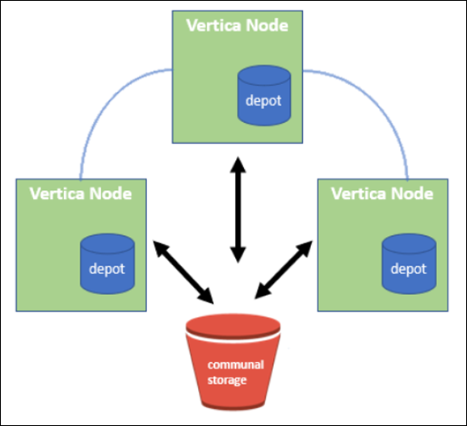

= NetApp StorageGRID を共有ストレージとして使用したVertica Eonモードのデータベース
:allow-uri-read: 

Angela Cheng_

[role="lead"]
このガイドでは、NetApp StorageGRID のパブリックストレージを使用してVertica Eon Modeデータベースを作成する手順 について説明します。

== はじめに

Verticaは分析データベース管理ソフトウェアです。大量のデータを処理するように設計されたカラム型ストレージ・プラットフォームであり'従来の負荷の高いシナリオでは非常に高速なクエリー・パフォーマンスを実現しますVerticaデータベースは、EonまたはEnterpriseのいずれかのモードで動作します。両方のモードをオンプレミスまたはクラウドに導入できます。

EonモードとEnterpriseモードは、主にデータの保存場所によって異なります。

* Eonモードのデータベースは、データ用に共有ストレージを使用します。これはVerticaがお勧めします。
* Enterprise Modeデータベースでは、データベースを構成するノードのファイルシステムにデータがローカルに格納されます。

=== Eon Modeアーキテクチャ

Eonモードでは、計算リソースがデータベースの共有ストレージレイヤから分離され、コンピューティングとストレージを別々に拡張できます。EonモードのVerticaは、さまざまなワークロードに対応し、コンピューティングリソースとストレージリソースを別々に使用してワークロードを分離するように最適化されています。

Eon Modeは、パブリックストレージと呼ばれる共有オブジェクトストアにデータを格納します。パブリックストレージとは、オンプレミスまたはAmazon S3上にホストされるS3バケットです。

=== 共有ストレージ

Eonモードでは、データをローカルに格納する代わりに、すべてのデータとカタログ（メタデータ）に単一の共有ストレージロケーションを使用します。共有ストレージとは、データベースの一元管理されたストレージの場所で、データベースノード間で共有されるものです。

共有ストレージには次のプロパティがあります。

* クラウドまたはオンプレミスのオブジェクトストレージ内の共有ストレージは、個々のマシンのディスク上のストレージよりも耐障害性が高く、ストレージ障害によるデータ損失の影響を受けにくくなっています。
* すべてのデータは、同じパスを使用して任意のノードで読み取ることができます。
* ノードのディスクスペースによる容量制限はありません。
* データは通信環境に保管されるため、変化するニーズに合わせてクラスタを柔軟に拡張できます。データがノードにローカルに格納されていた場合は、ノードを追加または削除するときに、ノード間で移動するデータが大量に必要になります。これを行うには、削除対象のノードから移動するか、新しく作成したノードに移動する必要があります。

=== デポ

共有ストレージの欠点の1つは速度です。共有クラウド上の場所からデータにアクセスする場合、ローカルディスクからデータを読み取る場合よりも時間がかかります。また、多数のノードが一度にデータを読み取っている場合、共有ストレージへの接続がボトルネックになる可能性があります。データアクセス速度を向上させるために、Eon Modeデータベース内のノードは、デポと呼ばれるデータのローカルディスクキャッシュを保持します。クエリを実行するとき、ノードはまず、必要なデータがデポにあるかどうかをチェックします。存在する場合は、データのローカルコピーを使用してクエリが完了します。データがデポにない場合、ノードは共有ストレージからデータを取得し、デポにコピーを保存します。

== NetApp StorageGRID の推奨事項

Verticaは、データベースのデータをオブジェクトストレージに何千（数百万）もの圧縮オブジェクトとして格納します（1オブジェクトあたり200～500MB）。ユーザーがデータベースクエリを実行すると、Verticaはバイト範囲GET呼び出しを使用して、圧縮されたオブジェクトから選択したデータ範囲を並列に取得します。バイト範囲GETはそれぞれ約8KBです。

10TBのデータベースデポのユーザクエリテストでは、1秒あたり4、000~ 10、000個のGET（バイト範囲GET）要求がグリッドに送信されました。SG6060アプライアンスを使用してこのテストを実行した場合、アプライアンスノードあたりのCPU利用率は（20~30%程度）が低いため、CPU時間の2/3でI/Oを待機していますSGF6024では、I/O待機時間のごく一部（0%~ 0.5%）が確認されます。

IOPSは小さいが高いことから、レイテンシの要件は非常に低い（平均値は0.01秒未満）ため、オブジェクトストレージサービスにはSFG6024を使用することを推奨します。非常に大きなデータベースサイズにSG6060が必要な場合は、お客様はデポサイジングのVerticaアカウントチームと協力して、照会中のデータセットをサポートする必要があります。

管理ノードとAPIゲートウェイノードの場合は、お客様がSG100またはSG1000を使用できます。選択する内容は、ユーザのクエリ要求の並列サイズとデータベースサイズによって異なります。他社製ロードバランサを使用する場合は、ハイパフォーマンスが要求されるワークロードに専用のロードバランサを使用することを推奨します。StorageGRID のサイジングについては、ネットアップアカウントチームにお問い合わせください。

StorageGRID 構成に関するその他の推奨事項は次のとおりです。

* *グリッドトポロジ*。同じグリッドサイトにある他のストレージアプライアンスモデルとSGF6024を混在させないでください。長期アーカイブ保護にSG6060を使用する場合は、アクティブデータベース用に専用のグリッドロードバランサを使用してSGF6024の負荷を専用のグリッドサイト（物理サイトまたは論理サイト）に配置し、パフォーマンスを向上させます。同じサイトに異なるモデルのアプライアンスを混在させると、サイト全体のパフォーマンスが低下します。
* *データ保護*。レプリケートコピーを使用して保護します。アクティブデータベースにはイレイジャーコーディングを使用しないでください。イレイジャーコーディングを使用することで、アクセス頻度の低いデータベースを長期にわたって保護できます。
* *グリッド圧縮を有効にしないでください*。Verticaは、オブジェクトを圧縮してからオブジェクトストレージに格納します。グリッド圧縮を有効にしてもストレージ使用量はこれ以上削減されず、バイト範囲のGETパフォーマンスが大幅に低下します。
* * HTTPとHTTPS S3エンドポイント接続*。ベンチマークテストでは、VerticaクラスタからStorageGRID ロードバランサエンドポイントへのHTTP S3接続を使用した場合、パフォーマンスが約5%向上しました。この選択は、顧客のセキュリティ要件に基づいて行う必要があります。

Vertica構成に関する推奨事項は次のとおりです。

* * Verticaデータベースのデフォルトデポ設定は、読み取りおよび書き込み操作で有効(値=1)になっています。*パフォーマンスを向上させるために、これらのデポ設定を有効にしておくことを強く推奨します。
* *ストリーミング制限を無効にします。*設定の詳細については、を参照してください <<Streamlimitations,ストリーミング制限を無効にしています>>。

== StorageGRID 上の共有ストレージを使用してオンプレミスモードをインストールする

以下のセクションでは、StorageGRID 上に共同ストレージを使用してオンプレミスにEonモードをインストールするための手順 について説明します。オンプレミスのSimple Storage Service（S3）互換オブジェクトストレージを設定する手順 は、Vertica guideの手順 に似ています。 link:https://www.vertica.com/docs/10.1.x/HTML/Content/Authoring/InstallationGuide/EonOnPrem/InstallingEonOnPremiseWithMinio.htm?tocpath=Installing%20Vertica%7CInstalling%20Vertica%20For%20Eon%20Mode%20on-Premises%7C_____2["オンプレミスにEonモードデータベースをインストールします"^]。

機能テストには次のセットアップを使用しました。

* StorageGRID 11.4.0.4
* Vertica 10.1.0
* Verticaノードをクラスタに構成するために、CentOS 7.x OSを搭載した3台の仮想マシン（VM）。このセットアップは、Verticaプロダクションデータベースクラスタではなく、機能テストのみを対象としています。

これらの3つのノードにはSecure Shell（SSH）キーが設定されており、クラスタ内のノード間でパスワードを設定することなくSSHを使用できます。

=== NetApp StorageGRID で必要な情報

StorageGRID 上で共有ストレージを使用してオンプレミスにEonモードをインストールするには、次の前提条件情報が必要です。

* StorageGRID S3エンドポイントのIPアドレスまたは完全修飾ドメイン名（FQDN）とポート番号。HTTPSを使用する場合は、StorageGRID S3エンドポイントに実装されているカスタムの認証局（CA）または自己署名SSL証明書を使用します。
* バケット名。このパラメータは、あらかじめ存在し、空である必要があります。
* バケットへの読み取り/書き込みアクセスが可能なアクセスキーIDとシークレットアクセスキー。

=== S3エンドポイントにアクセスするための認証ファイルを作成します

S3エンドポイントにアクセスする許可ファイルを作成する際には、次の前提条件が適用されます。

* Verticaがインストールされている。
* クラスタをセットアップして設定し、データベースを作成できる状態にします。

S3エンドポイントにアクセスするための認証ファイルを作成するには、次の手順を実行します。

. 「admintools」を実行してEon Modeデータベースを作成するVerticaノードにログインします。
+
デフォルトのユーザーは'dbadmin'で'Verticaクラスタのインストール時に作成されます

. テキスト・エディタを使用して'/HOME/dbadminディレクトリの下にファイルを作成しますファイル名には'たとえばsg_auth.confなど'任意の名前を指定できます
. S3エンドポイントが標準のHTTPポート80またはHTTPSポート443を使用している場合は、ポート番号を省略します。HTTPSを使用するには、次の値を設定します。
+
** `awsenablehttps=1'それ以外の場合は'0`に値を設定します
** `awsauth=<s3 access key ID>：<secret access key>`
** `awsendpoint=< StorageGRID s3 endpoint>:<port>`
+
StorageGRID S3エンドポイントのHTTPS接続にカスタムCA証明書または自己署名SSL証明書を使用するには、証明書の完全なファイルパスとファイル名を指定します。このファイルは、各Verticaノード上の同じ場所にあり、すべてのユーザーに読み取り権限が与えられている必要があります。StorageGRID S3エンドポイントのSSL証明書が一般に知られているCAによって署名されている場合は、この手順を省略します。

+
-awscafile=<filepath/filename>`

+
たとえば、次のサンプルファイルを参照してください。

+
[listing]
----
awsauth = MNVU4OYFAY2xyz123:03vuO4M4KmdfwffT8nqnBmnMVTr78Gu9wANabcxyz
awsendpoint = s3.england.connectlab.io:10443
awsenablehttps = 1
awscafile = /etc/custom-cert/grid.pem
----
+

NOTE: 本番環境では、一般に知られているCAによって署名されたサーバ証明書をStorageGRID S3ロードバランサエンドポイントに実装する必要があります。

=== すべてのVerticaノードのデポパスを選択します

デポストレージパスの各ノードにディレクトリを選択または作成します。デポストレージパスパラメータに指定するディレクトリには、次のものが必要です。

* クラスタ内のすべてのノードで同じパス（例：/home/dbadmin/depot）
* dbadminユーザによる読み書きが可能になります
* 十分なストレージ
+
デフォルトでは、Verticaはデポ保存用のディレクトリを含むファイルシステム領域の60%を使用します。'create-db'コマンドの--depot-size'引数を使用すると、デポのサイズを制限できます。を参照してください link:https://www.vertica.com/blog/sizing-vertica-cluster-eon-mode-database/["EonモードデータベースのVertica Clusterのサイジング"^] Verticaの一般的なサイジングガイドラインについては、こちらをご覧ください。Vertica Account Managerにお問い合わせください。

+
'admintools create-db'ツールは'存在しない場合に備えて'デポパスを作成しようとします

=== オンプレミスデータベースの作成

オンプレミスデータベースを作成するには、次の手順を実行します。

. データベースを作成するには'admintools create-db'ツールを使用します
+
この例で使用されている引数の簡単な説明を次に示します。すべての必須引数とオプション引数の詳細については、Verticaのドキュメントを参照してください。

+
** -x <で作成された認証ファイルのパス/ファイル名 <<createauthorization,「S3エンドポイントにアクセスするための認証ファイルの作成」>> >。
+
認証の詳細は、正常に作成された後、データベース内に保存されます。S3シークレットキーの公開を回避するために、このファイルを削除できます。

** --son/storagegrid-sstorage -location <s3：//storagegrid bucketname>
** -s <このデータベースに使用するVerticaノードのカンマ区切りリスト>
** -d <作成するデータベースの名前>
** -p <この新しいデータベースに設定するパスワード>。たとえば、次のコマンド例を参照してください。
+
[listing]
----
admintools -t create_db -x sg_auth.conf --communal-storage-location=s3://vertica --depot-path=/home/dbadmin/depot --shard-count=6 -s vertica-vm1,vertica-vm2,vertica-vm3 -d vmart -p '<password>'
----
+
データベースのノード数によっては、新しいデータベースの作成に数分かかることがあります。データベースを初めて作成するときに、ライセンス契約に同意するように求められます。

たとえば'次のサンプル認証ファイルと'create db'コマンドを参照してください

[listing]
----
[dbadmin@vertica-vm1 ~]$ cat sg_auth.conf
awsauth = MNVU4OYFAY2CPKVXVxxxx:03vuO4M4KmdfwffT8nqnBmnMVTr78Gu9wAN+xxxx
awsendpoint = s3.england.connectlab.io:10445
awsenablehttps = 1

[dbadmin@vertica-vm1 ~]$ admintools -t create_db -x sg_auth.conf --communal-storage-location=s3://vertica --depot-path=/home/dbadmin/depot --shard-count=6 -s vertica-vm1,vertica-vm2,vertica-vm3 -d vmart -p 'xxxxxxxx'
Default depot size in use
Distributing changes to cluster.
    Creating database vmart
    Starting bootstrap node v_vmart_node0007 (10.45.74.19)
    Starting nodes:
        v_vmart_node0007 (10.45.74.19)
    Starting Vertica on all nodes. Please wait, databases with a large catalog may take a while to initialize.
    Node Status: v_vmart_node0007: (DOWN)
    Node Status: v_vmart_node0007: (DOWN)
    Node Status: v_vmart_node0007: (DOWN)
    Node Status: v_vmart_node0007: (UP)
    Creating database nodes
    Creating node v_vmart_node0008 (host 10.45.74.29)
    Creating node v_vmart_node0009 (host 10.45.74.39)
    Generating new configuration information
    Stopping single node db before adding additional nodes.
    Database shutdown complete
    Starting all nodes
Start hosts = ['10.45.74.19', '10.45.74.29', '10.45.74.39']
    Starting nodes:
        v_vmart_node0007 (10.45.74.19)
        v_vmart_node0008 (10.45.74.29)
        v_vmart_node0009 (10.45.74.39)
    Starting Vertica on all nodes. Please wait, databases with a large catalog may take a while to initialize.
    Node Status: v_vmart_node0007: (DOWN) v_vmart_node0008: (DOWN) v_vmart_node0009: (DOWN)
    Node Status: v_vmart_node0007: (DOWN) v_vmart_node0008: (DOWN) v_vmart_node0009: (DOWN)
    Node Status: v_vmart_node0007: (DOWN) v_vmart_node0008: (DOWN) v_vmart_node0009: (DOWN)
    Node Status: v_vmart_node0007: (DOWN) v_vmart_node0008: (DOWN) v_vmart_node0009: (DOWN)
    Node Status: v_vmart_node0007: (UP) v_vmart_node0008: (UP) v_vmart_node0009: (UP)
Creating depot locations for 3 nodes
Communal storage detected: rebalancing shards

Waiting for rebalance shards. We will wait for at most 36000 seconds.
Installing AWS package
    Success: package AWS installed
Installing ComplexTypes package
    Success: package ComplexTypes installed
Installing MachineLearning package
    Success: package MachineLearning installed
Installing ParquetExport package
    Success: package ParquetExport installed
Installing VFunctions package
    Success: package VFunctions installed
Installing approximate package
    Success: package approximate installed
Installing flextable package
    Success: package flextable installed
Installing kafka package
    Success: package kafka installed
Installing logsearch package
    Success: package logsearch installed
Installing place package
    Success: package place installed
Installing txtindex package
    Success: package txtindex installed
Installing voltagesecure package
    Success: package voltagesecure installed
Syncing catalog on vmart with 2000 attempts.
Database creation SQL tasks completed successfully. Database vmart created successfully.
----
[cols="1a,1a"]
|===
| オブジェクトのサイズ（バイト） | バケット/オブジェクトキーの完全パス 

 a| 
61`
 a| 
`s3://Vertica/051/026d63ae9d4a33237bf0e2cf2a794a794a000000000021a07/026d63ae9d4a33237bf0e2cf2a794a00a0000000000000021a07_00.dfd`

 a| 
145`
 a| 
`s3://Vertica/2c4/026d63ae9d4a33237bf0e2cf2a794a794a794a000000000000000021a3d/026d63ae9d4a33237bf0e2cf2a794a794a00a000000000021a3_0.dfd`

 a| 
146 `
 a| 
`s3://Vertica/33C/026d63ae9d4a33237bf0e2cf2a794a0000000021a1d/ 026d63ae9d4a33237bf0e2cf2a794a00000000000021a1d_0.dfd`

 a| 
「40」
 a| 
`s3://Vertica/382/026d63ae9d4a33237bf0e2cf2a794a794a0000000021a31/026d63ae9d4a33237bf0e2cf2a794a794a000000000021a31_0.dfs`

 a| 
145`
 a| 
`s3://Vertica/42f/026d63ae9d4a33237bf0e2cf2a794a794a00000000211/026d63ae9d4a33237bf0e2cf2a794a0000000000000021a_0.dfd`

 a| 
34`
 a| 
`s3://Vertica/472/026d63ae9d4a33237bf0e2cf2a794a794a000000000021a25/026d63ae9d4a33237bf0e2cf2a794a000000000000000021a25_0.df`

 a| 
41.
 a| 
`s3://Vertica/476/026d63ae9d4a33237bf0e2cf2a794a794a00000000000021a2d/026d63ae9d4a33237bf0e2c2cf2a794a00a00000000000021a2_0.dfd`

 a| 
61`
 a| 
`s3://Vertica/52A/026d63ae9d4a33237bf0e2cf2a794a794a0000000021a5d/026d63ae9d4a33237bf0e2cf2a794a794a000000000021a5d_0.df`

 a| 
「131」
 a| 
`s3://Vertica/5d2/026d63ae9d4a33237bf0e2cf2a794a794a000000000021a19/026d63ae9d4a33237bf0e2cf2a794a00a0000000000000021a19_0.df`

 a| 
「91」
 a| 
`s3://Vertica/5f7/026d63ae9d4a33237bf0e2cf2a794a794a000000000021a11/026d63ae9d4a33237bf0e2cf2a794a00a00000000000021a11_0.df`

 a| 
「118」
 a| 
`s3://Vertica/82D/026d63ae9d4a33237bf0e2cf2a794a794a0000000021a15/026d63ae9d4a33237bf0e2cf2a794a0000000000000021a15_0.df`

 a| 
「115」
 a| 
`s3://Vertica/922/026d63ae9d4a33237bf0e2cf2a794a794a0000000021a61/026d63ae9d4a33237bf0e2cf2a794a0000000000000021a61_0.df`

 a| 
「33」
 a| 
`s3://Vertica/ACD/ 026d63ae9d4a33237bf0e2cf2a794a794a000000000021a29/026d63ae9d4a33237bf0e2cf2a794a794a00000000000021a29_0.dfs`

 a| 
「133」
 a| 
`s3://Vertica/b98/026d63ae9d4a33237bf0e2cf2a794a794a00a00000000000021a4d/026d63ae9d4a33237bf0e2cf2a794a794a00a000000000021a4d_0.df`

 a| 
「38」
 a| 
`s3://Vertica/db3/026d63ae9d4a33237bf0e2cf2a794a794a000000000021a49/026d63ae9d4a33237bf0e2cf2a794a00a0000000000000021a49_0.df`

 a| 
「38」
 a| 
`s3://Vertica/eba/ 026d63ae9d4a33237bf0e2cf2a794a794a000000000021a59/026d63ae9d4a33237bf0e2cf2a794a794a0000000021a59_0.dfdfs.dfs

 a| 
21521920`
 a| 
`s3://vertica/metadata/VMart/Library/Libraryd63ae9d4a33237bf0e2c2cf2a794a00a000000000000215e2/026d63ae9d4a33237bf0e2c2cf2a794a000000215e2.tar`

 a| 
6865408`
 a| 
`s3://vertica/metodat/VMart/Library/Libraryd63ae9d4a33237bf0e2c2cf2a794a00a0000000021602/026d63ae9d4a33237bf0e2c2cf2a794a0000000000000021602.tar`

 a| 
「204217344」
 a| 
`s3://vertica/metodata/mart/Library/Libraryd63ae9d4a33237bf0e2c2cf2a794a00a0000000021610/026d63ae9d4a33237bf0e2c2cf2a794a00a000000000000000021610.tar`

 a| 
16109056`
 a| 
`s3://vertica/metadata/VMart/Library/Libraryd63ae9d4a33237bf0e2c2cf2a794a00a00000000217e0/026d63ae9d4a33237bf0e2c2cf2a794a0000000000217e0.tar`

 a| 
12853248`
 a| 
`s3://vertica/metadata/VMart/Library/Libraryd63ae9d4a33237bf0e2c2cf2a794a00a0000000000000021800/026d63ae9d4a33237bf0e2c2cf2a794a00a0000000000000000000000218.tar`

 a| 
「8937984」と入力します
 a| 
`s3://vertica/metadata/VMart/Library/Libraryd63ae9d4a33237bf0e2c2cf2a794a00a00000000002187a/026d63ae9d4a33237bf0e2c2cf2a794a00a00002187a.tar`

 a| 
「56260`606060860」
 a| 
`s3://vertica/metadata/VMart/Library/Libraryd63ae9d4a33237bf0e2c2cf2a794a00a00000000000000218b2/026d63ae9d4a33237bf0e2c2cf2a794a0000000000218b2.tar`

 a| 
「53947904」
 a| 
`s3://vertica/metadata/VMart/Library/Libraryd63ae9d4a33237bf0e2c2cf2a794a00a00000000000000219ba/026d63ae9d4a33237bf0e2c2cf2a794a0000000000219ba.tar`

 a| 
44932`608
 a| 
`s3://vertica/metadata/VMart/Library/Libraryd63ae9d4a33237bf0e2c2cf2a794a00a000000000000219de/026d63ae9d4a33237bf0e2c2cf2a794a00000000000000219de.tar`

 a| 
「256306688」
 a| 
`s3://vertica/metadata/VMart/Librarys/026d63ae9d4a33237bf0e2c2cf2a794a00a00000000000021a6e/026d63ae9d4a33237bf0e2c2cf2a794a000000000000000021a6e.tar`

 a| 
「8062464`」
 a| 
`s3://vertica/metadata/VMart/Library/Libraryd63ae9d4a33237bf0e2c2cf2a794a00a0000000021e34/026d63ae9d4a33237bf0e2c2cf2a794a00000000000000000021e34.tar`

 a| 
「20024832」
 a| 
`s3://vertica/metadata/VMart/Library/Libraryd63ae9d4a33237bf0e2c2cf2a794a00a0000000021e70/026d63ae9d4a33237bf0e2c2cf2a794a00000000000000000021e70.tar`

 a| 
「10444」
 a| 
`s3://vertica/metadata/VMart/cluster _config.json

 a| 
「823266」
 a| 
`s3://vertica/metadata/VMart/nodes/v _vmart_node0016/Catalog/859703b06a3456d95d0be28575a673/Checks/C13_13/chkpt_1.cat.gz`

 a| 
「254」
 a| 
`s3://vertica/metadata/VMart/nodes/v _vmart_node0016/Catalog/859703b06a3456d95d0be28575a673/Checks/C13_13/Completed`

 a| 
「2958」
 a| 
`s3://vertica/metadata/VMart/nodes/v _vmart_node0016/Catalog/859703b06a3456d95d0be28575a673/Checkpoints /C2_2/chkpt_1.cat.gz`

 a| 
231`
 a| 
`s3://vertica/metadata/VMart/nodes/v _vmart_node0016/Catalog/859703b06a3456d95d0be28575a673/Checks/C2_2/Completed`

 a| 
「822521」
 a| 
`s3://vertica/metadata/VMart/nodes/v _vmart_node0016/Catalog/859703b06a3456d95d0be28575a673/Checks/C4_4/chkpt_1.cat.gz`

 a| 
231`
 a| 
`s3://vertica/metadata/VMart/nodes/v _vmart_node0016/Catalog/859703b06a3456d95d0be28575a673/Checks/C4_4/Completed`

 a| 
746513`
 a| 
`s3://vertica/metadata/VMart/nodes/v _vmart_node0016/Catalog/859703b06a3456d95d0be28575a673/Txnlogs/txn_14_g14.cat`

 a| 
「2596」
 a| 
`s3://vertica/metadata/VMart/nodes/v _vmart_node0016/Catalog/859703b06a3456d95d0be28575a673/Txnlogs/txn_3_g3.cat.gz`

 a| 
821065`
 a| 
`s3://vertica/metadata/VMart/nodes/v _vmart_node0016/Catalog/859703b06a3456d95d0be28575a673/Txnlogs/txn_4_g4.cat.gz`

 a| 
6440`
 a| 
`s3://vertica/metadata/VMart/nodes/v _vmart_node0016/Catalog/859703b06a3456d95d0be28575a673/Txnlogs/txn_5_g5.cat`

 a| 
「8518」
 a| 
`s3://vertica/metadata/VMart/nodes/v _vmart_node0016/Catalog/859703b06a3456d95d0be28575a673/Txnlogs/txn_8_g8.cat`

 a| 
「 0 」
 a| 
`s3://vertica/metadata/VMart/nodes/v _vmart_node0016/Catalog/859703b06a3456d95d0be28575a673/tiered_catalog.cat`

 a| 
822922`
 a| 
`s3://vertica/metadata/VMart/nodes/v _vmart_node0017/Catalog/859703b06a3456d95d0be28575a673/Checkpoints /Checkpoints /C14-7/chkpt_1.cat.gz`

 a| 
「232」
 a| 
`s3://vertica/metadata/VMart/nodes/v _vmart_node0017/Catalog/859703b06a3456d95d0be28575a673/Checkpoints /Checkpoints /C14-7/Completed`

 a| 
822930`
 a| 
`s3://vertica/metadata/VMart/nodes/v _vmart_node0017/Catalog/859703b06a3456d95d0be28575a673/Txnlogs/txn_14_g7.cat.gz`

 a| 
755033`
 a| 
`s3://vertica/metadata/VMart/nodes/v _vmart_node0017/Catalog/859703b06a3456d95d0be28575a673/Txnlogs/txn_15_g8.cat`

 a| 
「 0 」
 a| 
`s3://vertica/metadata/VMart/nodes/v _vmart_node0017/Catalog/859703b06a3456d95d0be28575a673/tiered_catalog.cat`

 a| 
822922`
 a| 
`s3://vertica/metadata/VMart/nodes/v _vmart_node0018/Catalog/859703b06a3456d95d0be28575a673/Checkpoints /Checkpoints /C14-7/chkpt_1.cat.gz`

 a| 
「232」
 a| 
`s3://vertica/metadata/VMart/nodes/v _vmart_node0018/Catalog/859703b06a3456d95d0be28575a673/Checkpoints /Checkpoints /C14-7/Completed`

 a| 
822930`
 a| 
`s3://vertica/metadata/VMart/nodes/v _vmart_node0018/Catalog/859703b06a3456d95d0be28575a673/Txnlogs/txn_14_g7.cat.gz`

 a| 
755033`
 a| 
`s3://vertica/metadata/VMart/nodes/v _vmart_node0018/Catalog/859703b06a3456d95d0be28575a673/Txnlogs/txn_15_g8.cat`

 a| 
「 0 」
 a| 
`s3://vertica/metadata/VMart/nodes/v _vmart_node0018/Catalog/859703b06a3456d95d0be28575a673/tiered_catalog.cat`

|===

=== ストリーミング制限を無効にしています

この手順 は、他のオンプレミスオブジェクトストレージのVertica guideに基づいており、StorageGRID に適用する必要があります。

. データベースを作成したら'AWSStreamingConnectionPercentage'設定パラメータを0に設定して無効にしますこの設定は、共同ストレージを使用したオンプレミス環境でのEonモードのインストールには不要です。この設定パラメータは、Verticaがストリーミング読み取りに使用するオブジェクトストアへの接続数を制御します。クラウド環境では、この設定が有効な場合、オブジェクトストアからのストリーミングデータが使用可能なすべてのファイルハンドルを使い使わないようにすることができます。他のオブジェクトストア処理に使用できるファイルハンドルが残っています。オンプレミスのオブジェクトストアのレイテンシが低いため、このオプションは不要です。
. パラメータ値を更新するには'vsql'文を使用しますパスワードは、「オンプレミスデータベースの作成」で設定したデータベースパスワードです。たとえば、次の出力例を参照してください。

[listing]
----
[dbadmin@vertica-vm1 ~]$ vsql
Password:
Welcome to vsql, the Vertica Analytic Database interactive terminal.
Type:   \h or \? for help with vsql commands
        \g or terminate with semicolon to execute query
        \q to quit
dbadmin=> ALTER DATABASE DEFAULT SET PARAMETER AWSStreamingConnectionPercentage = 0; ALTER DATABASE
dbadmin=> \q
----

=== デポの設定を確認してい

Verticaデータベースのデフォルトデポ設定は、読み取りおよび書き込み操作に対して有効(値=1)です。パフォーマンスを向上させるために、これらのデポ設定を有効にしておくことを強く推奨します。

[listing]
----
vsql -c 'show current all;' | grep -i UseDepot
DATABASE | UseDepotForReads | 1
DATABASE | UseDepotForWrites | 1
----

=== サンプルデータのロード（オプション）

このデータベースをテスト用に使用し、削除する場合は、サンプルデータをテスト用にこのデータベースにロードできます。Verticaには、各Verticaノードの「/opt/vertica/examples/VMart _Schema/」にあるサンプルデータセットVMartが付属しています。このサンプルデータセットの詳細については、を参照してください link:https://www.vertica.com/docs/10.1.x/HTML/Content/Authoring/GettingStartedGuide/IntroducingVMart/IntroducingVMart.htm?zoom_highlight=VMart["こちらをご覧ください"^]。

サンプルデータをロードするには、次の手順を実行します。

. いずれかのVerticaノードにdbadminとしてログインします。cd /opt/vertica/examples/VMart _Schema/
. サンプルデータをデータベースにロードし、手順cとdでプロンプトが表示されたらデータベースのパスワードを入力します。
+
.. 「cd /opt/vertica/examples/VMart _Schema'」と入力します
.. 「./vmart_gen」
.. vsql <vmart_define_schema.sql
.. 「vsql <vmart_load_data.sql」

. 事前定義された複数のSQLクエリがあります。そのうちの一部を実行して、テストデータがデータベースに正常にロードされたことを確認できます。たとえば、「vsql <vmart_queries1.sql」のようになります

== 追加情報の参照先

このドキュメントに記載されている情報の詳細については、以下のドキュメントや Web サイトを参照してください。

* link:https://docs.netapp.com/us-en/storagegrid-117/["NetApp StorageGRID 11.7製品ドキュメント"^]
* link:https://www.netapp.com/pdf.html?item=/media/7931-ds-3613.pdf["StorageGRID データシート"^]
* link:https://www.vertica.com/documentation/vertica/10-1-x-documentation/["Vertica 10.1製品マニュアル"^]

== バージョン履歴

[cols="1a,1a,2a"]
|===
| バージョン | 日付 | ドキュメントのバージョン履歴 

 a| 
バージョン 1.0 以降
 a| 
2021年9月
 a| 
初版リリース

|===